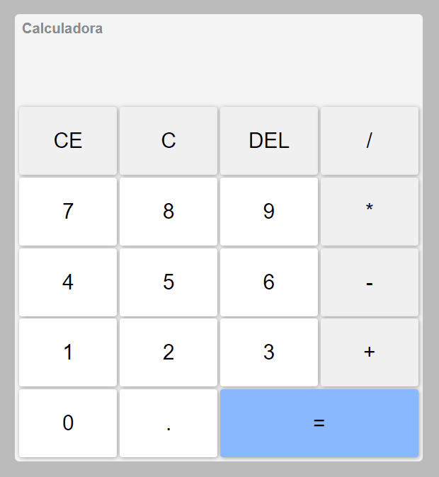

# Calculadora Simples 📱

## Acesse o Projeto

- 🔗[Acesse o Projeto Aqui!](https://thasyo.github.io/simpleCalculator/)

## 📃 Descrição 📃

- Projeto simples de uma calculadora com suas funcionalidades principais. 

## 🛠️ Tecnologias 🛠️

- HTML
- CSS
- JAVASCRIPT
- GIT
- GITHUB
- VSCODE

## 👨‍💻 Experiência Pessoal 👨‍💻

- Este projeto abriu os meus olhos para novos horizontes e me incentivou a estudar mais e me aprofundar em JavaScript Puro - famoso Vanilla JavaScript. 

- Pretendo fazer mais projeto com essa temática e metodologia de codificação. 

- Próximo passo

    - Estudar Fetch API e suas funcionalidades;
    - Fazer um projeto utilizando tudo que aprendi até aqui, juntamente com os novos aprendizados em Fetch API;

- Desafios

    - Neste projeto, tive a necessidade de estudar um pouco mais sobre POO, utilizando Classes para agregar as funcionalidades. Confesso que foi um desafio e tanto, pois foi meu primeiro contato com um projeto que era necessário e mais limpo de se fazer utilizando programação orientada a objetos. Foi muito interessante! Aprendi bastante.

## 🛑 Não pare por aqui! 🛑

- Gostou do meu projeto? Então me acompanhe no linkedin, para ficar por dentro das minhas últimas aplicações! 😉

- 🔗[Linkedin](https://www.linkedin.com/in/thasyo-peres-63aa27235/)